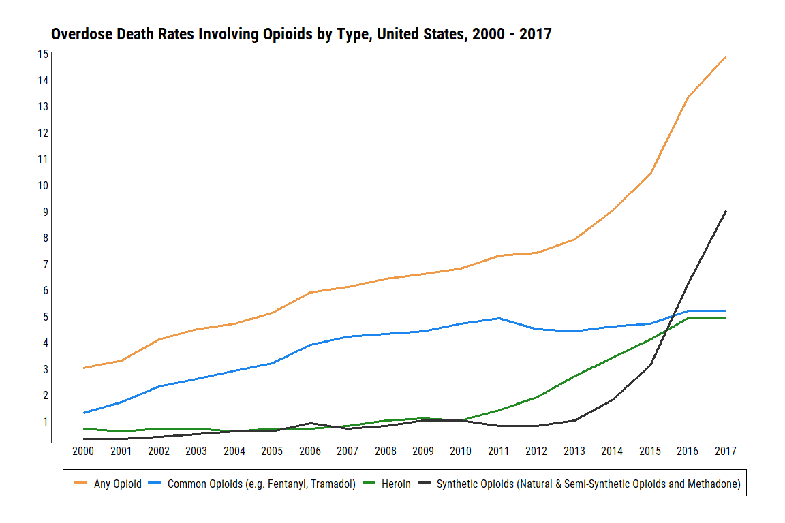

CDC Opioid Death Rate Figure Replication
================
Michael Maguire, MS
3/31/2021

``` r
library(hrbrthemes)
library(readr)
library(tidyverse)
library(tidylog)
```

## Read in CDC data set.

``` r
cdc <-
  read_csv(
    file = "./data/raw/cdc-opioid-death-rate-data.csv"
  ) %>%
  janitor::clean_names() %>%
  rename(
    synthetic_opioids = synthetic_opioid_analgesics_excluding_methadone_e_g_fentanyl_tramadol,
    common_opioids = commonly_prescribed_opioids_natural_semi_synthetic_opioids_and_methadone
  )
```

    ## 
    ## -- Column specification --------------------------------------------------------
    ## cols(
    ##   Year = col_double(),
    ##   `Any Opioid` = col_double(),
    ##   `Synthetic opioid analgesics, excluding methadone (e.g., fentanyl, tramadol)` = col_double(),
    ##   `Commonly Prescribed Opioids(Natural & Semi-Synthetic Opioids and Methadone)` = col_double(),
    ##   Heroin = col_double()
    ## )

    ## rename: renamed 2 variables (synthetic_opioids, common_opioids)

``` r
## Show contents
cdc
```

    ## # A tibble: 18 x 5
    ##     year any_opioid synthetic_opioids common_opioids heroin
    ##    <dbl>      <dbl>             <dbl>          <dbl>  <dbl>
    ##  1  2000        3                 0.3            1.3    0.7
    ##  2  2001        3.3               0.3            1.7    0.6
    ##  3  2002        4.1               0.4            2.3    0.7
    ##  4  2003        4.5               0.5            2.6    0.7
    ##  5  2004        4.7               0.6            2.9    0.6
    ##  6  2005        5.1               0.6            3.2    0.7
    ##  7  2006        5.9               0.9            3.9    0.7
    ##  8  2007        6.1               0.7            4.2    0.8
    ##  9  2008        6.4               0.8            4.3    1  
    ## 10  2009        6.6               1              4.4    1.1
    ## 11  2010        6.8               1              4.7    1  
    ## 12  2011        7.3               0.8            4.9    1.4
    ## 13  2012        7.4               0.8            4.5    1.9
    ## 14  2013        7.9               1              4.4    2.7
    ## 15  2014        9                 1.8            4.6    3.4
    ## 16  2015       10.4               3.1            4.7    4.1
    ## 17  2016       13.3               6.2            5.2    4.9
    ## 18  2017       14.9               9              5.2    4.9

## Transpose CDC data set

``` r
cdc_tp <-
  cdc %>%
    pivot_longer(
      data = .,
      cols = !year,
      names_to = "drug_type",
      values_to = "death_rate"
    ) %>%
  # Have to create a fake date to make scale in plot recognize it as a date.
  mutate(date_display = as.Date(paste0(year,"-","01","-","01")))
```

    ## pivot_longer: reorganized (any_opioid, synthetic_opioids, common_opioids, heroin) into (drug_type, death_rate) [was 18x5, now 72x3]

    ## mutate: new variable 'date_display' (Date) with 18 unique values and 0% NA

``` r
cdc_tp
```

    ## # A tibble: 72 x 4
    ##     year drug_type         death_rate date_display
    ##    <dbl> <chr>                  <dbl> <date>      
    ##  1  2000 any_opioid               3   2000-01-01  
    ##  2  2000 synthetic_opioids        0.3 2000-01-01  
    ##  3  2000 common_opioids           1.3 2000-01-01  
    ##  4  2000 heroin                   0.7 2000-01-01  
    ##  5  2001 any_opioid               3.3 2001-01-01  
    ##  6  2001 synthetic_opioids        0.3 2001-01-01  
    ##  7  2001 common_opioids           1.7 2001-01-01  
    ##  8  2001 heroin                   0.6 2001-01-01  
    ##  9  2002 any_opioid               4.1 2002-01-01  
    ## 10  2002 synthetic_opioids        0.4 2002-01-01  
    ## # ... with 62 more rows

## Plot the transposed data set.

``` r
cdc_plot <-
cdc_tp %>%
  ggplot() +
    geom_line(aes(x = date_display, y = death_rate, color = drug_type), size = 1.25) +
    scale_x_date(date_breaks = "1 year", date_labels = "%Y") +
    scale_y_continuous(expand = c(0.01,0.01), breaks = seq(0, 15, by = 1)) +
    theme_ipsum_rc(grid = FALSE) +
    ggtitle("Overdose Death Rates Involving Opioids by Type, United States, 2000 - 2017") +
    xlab("") +
    ylab("") +
    theme(
      panel.background = element_rect(color = "grey20"),
      axis.title.x = element_text(angle = 90, color = "black", size = 12),
      axis.text.x = element_text(color = "black", size = 12),
      axis.text.y = element_text(color = "black", size = 12),
      legend.position = "bottom",
      legend.background = element_rect(linetype = "solid"),
      legend.text = element_text(size = 12)
      ) +
    scale_color_manual(
      name = "",
      labels = c(
        "Any Opioid",
        "Common Opioids (e.g. Fentanyl, Tramadol)",
        "Heroin",
        "Synthetic Opioids (Natural & Semi-Synthetic Opioids and Methadone)"
      ),
      values = c(
        "tan2",
        "dodgerblue2",
        "forestgreen",
        "grey20"
      )
    )

# Show plot
cdc_plot
```

<!-- -->
